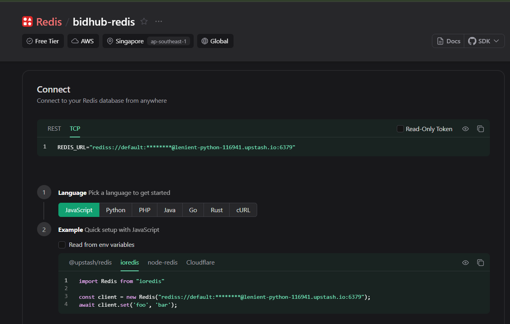

# how to intialize the ts nodejs project and setup

[how to setup nodejs with TS](https://claude.ai/share/f70bb1a8-cf32-4e11-a04d-b0381ff60e5c)

---

# How to structure ws code in backend.

[how to structure ws server and its handlers](https://claude.ai/share/42967e72-e481-4dcd-9421-ccd66f6806ce)

---

# upstash redis

1. What is serverless ?

- Traditional server = Running 24/7 waiting for incoming req and send res. Whether 0 requests or 1000 requests come in, the server is always alive.
- Serverless = First of all, there is server but when req comes. the server starts and function calls. response send to client and server shut downs. eg. lambda functions and nextjs api routes are serverless functions. when req hits. it starts, process the req and send back the response. server get shut down. pay as per reqs.

**So I have to use `ioredis` with upstash redis db and also use the TCP connection approach because there is websocket connection and `ioredis` supports TCP connection.**

